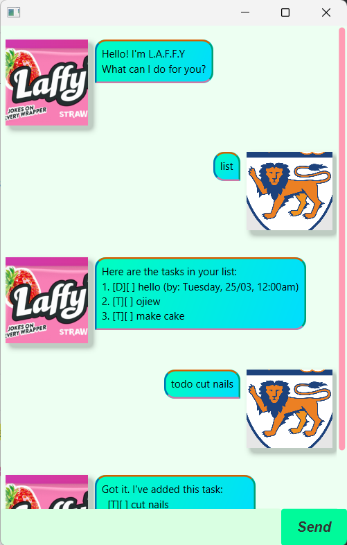

# Laffy User Guide




> "Hello, I am Laffy, Lucas' Automated Friendship For You." - Laffy 😊

Laffy is a task management application that helps you keep track of your tasks. It is a CLI app that allows you to add, mark, unmark, list, delete, and find tasks.

# Features

- **Add tasks:** Add different types of tasks such as todos, deadlines, and events.
- **Mark tasks:** Mark tasks as done.
- **Unmark tasks:** Unmark tasks that are marked as done.
- **List tasks:** List all tasks.
- **Delete tasks:** Delete tasks from the list.
- **Find tasks:** Find tasks by searching for keywords.
- **Upcoming tasks:** View tasks that are due soon.

## Add tasks
Adds a task to the list. Tasks can be todos, deadlines, or events.
Examples:
- `todo read book`
- `deadline return book /by 2002-06-21 1540`
- `event project meeting /from 2002-06-21 15:40 /to 2002-06-22 1540`

Usage:
```
todo <description>
deadline <description> /by <date:YYYY-MM-DD> <time:HHMM, optional>
event <description> /from <date:YYYY-MM-DD> <time> /to <date:YYYY-MM-DD> <time, optional>
```

Expected output:
```
Got it. I've added this task:
    [T][ ] read book
```

## Mark tasks
Marks a task as done based on its index in the list.

Usage:
```
mark <index>
```

Expected output:
```
Nice! I've marked this task as done:
    [T][X] read book
```

## Unmark tasks
Unmarks a task that is marked as done based on its index in the list.

Usage:
```
unmark <index>
```

Expected output:
```
Nice! I've unmarked this task:
    [T][ ] read book
```

## List tasks
Lists all tasks.

Usage:
```
list
```

Expected output:
```  
Here are the tasks in your list:
1. [T][X] read book
2. [D][ ] return book (by: Friday, 21/06/2002, 03:40pm)
3. [E][ ] project meeting (from: Friday, 21/06/2002, 03:40pm to: Saturday, 22/06/2002, 03:40pm)
```

## Delete tasks
Deletes a task from the list based on its index in the list.
    
Usage:
```
delete <index>
```

Expected output:
```
Noted. I've removed this task:
[T][X] read book
```

## Find tasks
Finds tasks by searching for keywords in the description of each task.

Usage:
```
find <keyword>
```

Expected output:
```
Here are the matching tasks in your list:
1. [D][ ] return book (by: Friday, 21/06/2002, 03:40pm)
```

## Upcoming tasks
Lists tasks that are due or happening in the future.

Usage:
```
upcoming
```

Expected output:
```
Here are the upcoming tasks in your list:
1. [D][ ] return book (by: Friday, 21/06/2002, 03:40pm)
```

## Exit
Exits the application.

Usage:
```
bye
```

Expected output:
```
Bye. Hope to see you again soon!
```
